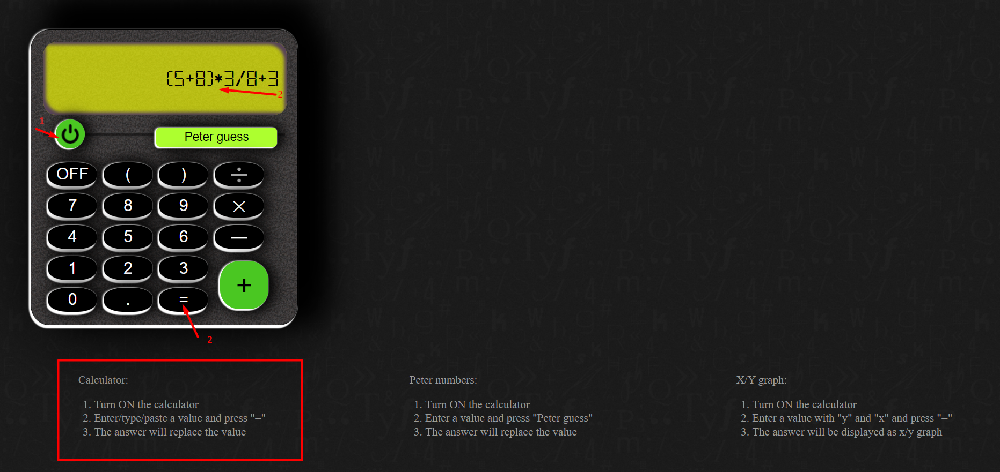
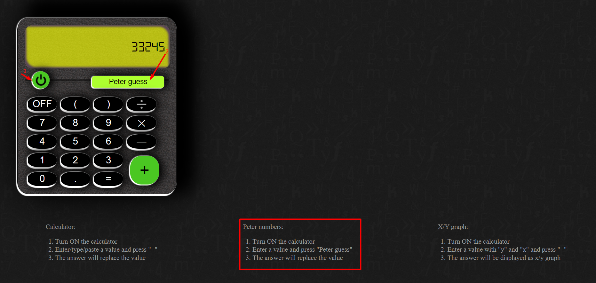
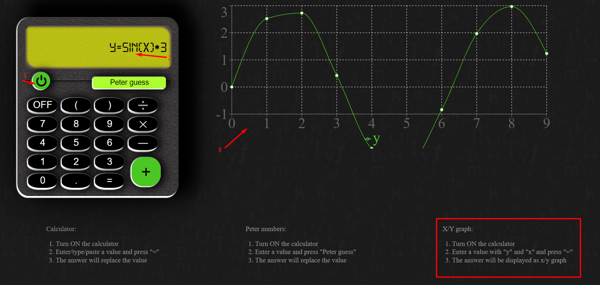

# Project Title

Simple calculator with basic operators like *, /, +, -, sin and cos

## Description

Calculator can
do basic math calculation: *, /, +, -, sin and cos (f.e. 4+2=6),
draw a graph x/y (f.e.: y=cos(x)*3)
find the last number before the given one, the digits of which are sorted in ascending order (for example: for 23245 it is 22999)

## Getting Started

### Installing

```
npm i
```

### Executing program

```
npm start
```

### Build

```
npm run build
```

### Demo

[link](https://mali3days.github.io/calculatorr/)

### Examples




